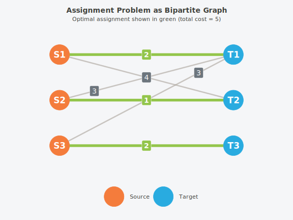

# Theory and Algorithms

### Overview

This vignette presents the mathematical formulation and algorithmic
foundations underlying couplr. Understanding these concepts helps you
choose the right solver for your problem, debug unexpected behavior, and
appreciate the theoretical guarantees. For practical usage examples, see
[`vignette("getting-started")`](https://gcol33.github.io/couplr/articles/getting-started.md)
and
[`vignette("matching-workflows")`](https://gcol33.github.io/couplr/articles/matching-workflows.md).

------------------------------------------------------------------------

### Terminology

#### Cost Matrix

A matrix $`C \in \mathbb{R}^{n \times m}`$ where entry $`c_{ij}`$
represents the cost of assigning source $`i`$ to target $`j`$. Sources
correspond to rows, targets to columns.

#### Assignment

A selection of (source, target) pairs such that each source is assigned
to at most one target, and each target receives at most one source.
Mathematically: binary variables $`x_{ij} \in \{0,1\}`$ with row-sum and
column-sum constraints.

#### Optimal Assignment

An assignment minimizing total cost $`\sum_{i,j} c_{ij} x_{ij}`$ (or
maximizing, for preference problems).

#### Dual Variables

Auxiliary variables $`(u_i, v_j)`$ associated with rows and columns.
Dual feasibility requires $`u_i + v_j \leq c_{ij}`$ for all pairs.
Strong duality ensures primal-dual optimality.

#### Tight Edge

An edge $`(i,j)`$ where the dual constraint holds with equality:
$`u_i + v_j = c_{ij}`$. Only tight edges can appear in optimal
solutions.

#### Augmenting Path

A path in the bipartite graph alternating between matched and unmatched
edges, starting and ending at unmatched vertices. Augmenting along such
a path increases matching cardinality.

------------------------------------------------------------------------

### Problem Formulation

#### Formal Statement

Given cost matrix $`C \in \mathbb{R}^{n \times m}`$, the linear
assignment problem (LAP) seeks:

``` math
\min \sum_{i=1}^{n} \sum_{j=1}^{m} c_{ij} x_{ij}
```

subject to:

``` math
\begin{aligned}
\sum_{j=1}^{m} x_{ij} &\leq 1 \quad \forall i \in \{1,\ldots,n\} \\[6pt]
\sum_{i=1}^{n} x_{ij} &\leq 1 \quad \forall j \in \{1,\ldots,m\} \\[6pt]
x_{ij} &\in \{0,1\} \quad \forall i,j
\end{aligned}
```

#### Dual Formulation

Associate dual variables $`u_i`$ (rows) and $`v_j`$ (columns):

``` math
\max \sum_{i=1}^{n} u_i + \sum_{j=1}^{m} v_j
```

subject to:

``` math
u_i + v_j \leq c_{ij} \quad \forall i,j
```

#### Complementary Slackness

Optimality condition connecting primal and dual:

``` math
x_{ij}^* > 0 \implies u_i^* + v_j^* = c_{ij}
```

Only assignments along tight edges can be optimal. This principle
underlies most efficient LAP algorithms.

------------------------------------------------------------------------

### Visualizing the Problem

The LAP corresponds to finding a minimum-weight perfect matching in a
weighted bipartite graph:



The optimal solution (green edges) assigns S1→T1, S2→T2, S3→T3 with
total cost 2 + 1 + 2 = 5.

------------------------------------------------------------------------

### Algorithm Selection Guide

    #> Warning: The `label.size` argument of `geom_label()` is deprecated as of ggplot2 3.5.0.
    #> ℹ Please use the `linewidth` argument instead.
    #> This warning is displayed once every 8 hours.
    #> Call `lifecycle::last_lifecycle_warnings()` to see where this warning was
    #> generated.


#### Quick Reference

| Algorithm | Complexity | Best For | Avoid When |
|----|----|----|----|
| Hungarian | $`O(n^3)`$ | Small problems, pedagogy | n \> 500 |
| Jonker-Volgenant | $`O(n^3)`$ expected | General purpose (default) | Extremely sparse |
| Auction | $`O(n^2 \log nC/\epsilon)`$ | Large dense (n \> 1000) | Small problems |
| SAP/LAPMOD | $`O(n^2 + nm)`$ | Sparse (\>50% forbidden) | Dense problems |
| HK01 | $`O(n^{2.5})`$ | Binary costs only | Non-binary costs |
| Gabow-Tarjan | $`O(n^3 \log C)`$ | Large integer cost ranges | Non-integer costs |
| CSA | $`O(n^3)`$ amortized | Medium-large dense | Small problems |
| Network Simplex | $`O(n^3)`$ typical | General, good dual info | — |
| Orlin-Ahuja | $`O(\sqrt{n} \cdot m \log nC)`$ | Large sparse with scaling | Small dense |
| Push-Relabel | $`O(n^2 m)`$ | Max-flow formulations | Dense problems |
| Ramshaw-Tarjan | $`O(nm \log n)`$ | Rectangular (n ≠ m) | Square dense |

------------------------------------------------------------------------

## Algorithms

### 1. Hungarian Algorithm

**Complexity**: $`O(n^3)`$

The classical method (Kuhn, 1955) based on work by Kőnig and Egerváry.
Maintains dual feasibility while iteratively improving the primal
solution.

#### Algorithm Steps

1.  **Initialize** dual variables: $`u_i = \min_j c_{ij}`$, $`v_j = 0`$
2.  **Construct equality graph** $`G_=`$ with tight edges only
3.  **Find maximum matching** in $`G_=`$
4.  **If complete**: optimal solution found
5.  **Otherwise**: compute dual update $`\Delta`$ and repeat

#### When to Use

- Educational purposes (clear conceptual structure)
- Small problems (n \< 500)
- When numerical stability is paramount

``` r

cost <- matrix(c(10, 19, 8, 15, 10, 11, 9, 12, 14), nrow = 3, byrow = TRUE)
result <- lap_solve(cost, method = "hungarian")
print(result)
#> Assignment Result
#> =================
#> 
#> # A tibble: 3 × 3
#>   source target  cost
#>    <int>  <int> <dbl>
#> 1      1      3     8
#> 2      2      2    10
#> 3      3      1     9
#> 
#> Total cost: 27 
#> Method: hungarian
```

------------------------------------------------------------------------

### 2. Jonker-Volgenant Algorithm

**Complexity**: $`O(n^3)`$ expected, $`O(n^2)`$ space

The default algorithm in couplr (1987). Uses shortest augmenting paths
with efficient column reduction preprocessing.

#### Key Features

- **Column reduction**: Greedy initial assignment
- **Shortest path augmentation**: Dijkstra-style search
- **ε-complementary slackness**: Allows larger steps than Hungarian

#### When to Use

- General-purpose default (`method = "auto"`)
- Dense problems up to n ≈ 2000
- When you need reliable, predictable performance

``` r

set.seed(123)
n <- 100
cost <- matrix(runif(n * n, 0, 100), n, n)
result <- lap_solve(cost, method = "jv")
cat("Total cost:", get_total_cost(result), "\n")
#> Total cost: 149.0911
```

------------------------------------------------------------------------

### 3. Auction Algorithm Family

**Complexity**: $`O(n^2 \log(nC) / \epsilon)`$

Economic approach (Bertsekas, 1988): sources “bid” for targets, prices
adjust based on competition.

#### Variants

| Variant      | Method Name        | Key Feature                   |
|--------------|--------------------|-------------------------------|
| Standard     | `"auction"`        | Fixed adaptive ε, queue-based |
| Scaled       | `"auction_scaled"` | ε-scaling phases              |
| Gauss-Seidel | `"auction_gs"`     | Sequential sweep              |

#### Core Algorithm

1.  Each unmatched source finds best target
2.  Compute bid increment based on first-best minus second-best
3.  Highest bidder wins; price increases
4.  Repeat until all matched


#### When to Use

- Large dense problems (n \> 1000)
- `"auction_scaled"` for large cost ranges (\> 10⁶)
- `"auction_gs"` for problems with spatial structure

``` r

set.seed(123)
n <- 200
cost <- matrix(runif(n * n, 0, 100), n, n)
result <- lap_solve(cost, method = "auction")
cat("Total cost:", get_total_cost(result), "\n")
#> Total cost: 159.057
```

------------------------------------------------------------------------

### 4. Sparse Assignment (SAP)

**Complexity**: $`O(n^2 + nm)`$ for $`m`$ edges

Optimized for sparse problems where most entries are forbidden (NA or
Inf).

#### Key Features

- Adjacency list representation
- Sparse priority queues
- Efficient for rectangular problems

#### When to Use

- Sparsity \> 50% (many forbidden entries)
- Rectangular problems (n ≠ m)
- Large but sparse structures

``` r

set.seed(789)
n <- 200
cost <- matrix(Inf, n, n)
edges <- sample(1:(n^2), floor(0.3 * n^2))
cost[edges] <- runif(length(edges), 0, 100)

result <- lap_solve(cost, method = "sap")
cat("Total cost:", get_total_cost(result), "\n")
#> Total cost: 564.3393
```

------------------------------------------------------------------------

### 5. Hopcroft-Karp for Binary Costs (HK01)

**Complexity**: $`O(n^{2.5})`$

Specialized for binary cost matrices where $`c_{ij} \in \{0, 1\}`$.

#### Algorithm

1.  Find maximum matching using only zero-cost edges
2.  Augment with minimum 1-cost edges if incomplete

#### When to Use

- Binary costs only (0 or 1)
- Unweighted bipartite matching
- Very large binary problems (n \> 10000)

``` r

set.seed(101)
n <- 300
cost <- matrix(sample(0:1, n^2, replace = TRUE, prob = c(0.3, 0.7)), n, n)
result <- lap_solve(cost, method = "hk01")
cat("Total cost:", get_total_cost(result), "\n")
#> Total cost: 0
```

------------------------------------------------------------------------

### 6. Gabow-Tarjan (Bit-Scaling)

**Complexity**: $`O(n^3 \log C)`$ where $`C`$ is the maximum cost

A sophisticated algorithm combining bit-scaling with Hungarian search
(Gabow & Tarjan, 1989). Particularly effective for integer costs with
large ranges.

#### Key Concepts

**Bit-scaling**: Process costs from most significant to least
significant bit. At scale $`k`$, work with costs
$`\lfloor c_{ij} / 2^k \rfloor`$.

**1-feasibility**: Relaxed complementary slackness allowing slack of 1:
``` math
u_i + v_j \leq c_{ij} + 1 \quad \text{(all edges)}
```
``` math
u_i + v_j \geq c_{ij} \quad \text{(matched edges)}
```

**Cost-length transformation**: Define edge lengths based on matching
status:
``` math
\ell(i,j) = \begin{cases} c_{ij} & \text{if } (i,j) \text{ matched} \\ c_{ij} + 1 & \text{otherwise} \end{cases}
```

#### Algorithm Structure

1.  **Initialize** at coarsest scale (highest bit)
2.  **Refine** by doubling costs and restoring feasibility
3.  **Hungarian search** for shortest augmenting paths
4.  **Dual updates** maintain 1-feasibility throughout
5.  **Repeat** until all bits processed

#### Complexity Analysis

- $`O(\log C)`$ scaling phases
- $`O(n)`$ augmenting paths per phase
- $`O(n^2)`$ per augmenting path (Hungarian search)
- **Total**: $`O(n^3 \log C)`$

#### When to Use

- Integer costs with large ranges ($`C > 10^6`$)
- When theoretical worst-case guarantees matter
- Research and algorithmic comparisons

``` r

set.seed(42)
n <- 50
cost <- matrix(sample(1:10000, n * n, replace = TRUE), n, n)
result <- lap_solve(cost, method = "gabow_tarjan")
cat("Total cost:", get_total_cost(result), "\n")
#> Total cost: 16884
```

#### Comparison with Other Methods

| Property        | Gabow-Tarjan        | Hungarian      | JV                  |
|-----------------|---------------------|----------------|---------------------|
| Complexity      | $`O(n^3 \log C)`$   | $`O(n^3)`$     | $`O(n^3)`$ expected |
| Cost dependence | Yes ($`\log C`$)    | No             | No                  |
| Best for        | Large integer costs | Small problems | General purpose     |

------------------------------------------------------------------------

### 7. Cost-Scaling Algorithm (CSA)

**Complexity**: $`O(n^3)`$ amortized

The Goldberg-Kennedy cost-scaling algorithm (1995), often the fastest
solver for medium-to-large dense problems in practice.

#### Key Concepts

- **ε-optimality**: Relaxed complementary slackness with tolerance ε
- **Price refinement**: Iteratively tighten ε from large to small
- **Push operations**: Move flow along admissible arcs

#### When to Use

- Medium-to-large dense problems (n = 200-2000)
- When practical speed matters more than theoretical guarantees
- General-purpose alternative to JV

``` r

set.seed(456)
n <- 150
cost <- matrix(runif(n * n, 0, 100), n, n)
result <- lap_solve(cost, method = "csa")
cat("Total cost:", get_total_cost(result), "\n")
#> Total cost: 167.4593
```

------------------------------------------------------------------------

### 8. Network Simplex

**Complexity**: $`O(n^3)`$ typical, polynomial worst-case

A specialized simplex method for network flow problems. Models
assignment as minimum-cost flow in a bipartite network.

#### Key Concepts

- **Spanning tree basis**: The basis is represented as a tree, not a
  matrix
- **Pivot operations**: Enter/leave arcs maintain tree structure
- **Dual variables**: Node potentials give sensitivity information

#### Network Structure

The assignment problem is modeled as a minimum-cost flow network:


**Pivot operation**: Enter a non-tree arc, find the cycle, identify
leaving arc, update tree and node potentials.

#### When to Use

- When you need dual variable information
- Problems with network structure
- Research and algorithmic comparisons

``` r

set.seed(789)
n <- 80
cost <- matrix(runif(n * n, 0, 100), n, n)
result <- lap_solve(cost, method = "network_simplex")
cat("Total cost:", get_total_cost(result), "\n")
#> Total cost: 153.6217
```

------------------------------------------------------------------------

### 9. Orlin-Ahuja Algorithm

**Complexity**: $`O(\sqrt{n} \cdot m \cdot \log(nC))`$

A sophisticated scaling algorithm (Orlin & Ahuja, 1992) combining
cost-scaling with capacity-scaling techniques.

#### Key Features

- **Double scaling**: Scales both costs and capacities
- **Blocking flow**: Finds multiple augmenting paths per phase
- **Strongly polynomial**: Performance independent of cost magnitudes

#### When to Use

- Large sparse problems with wide cost ranges
- When theoretical complexity guarantees matter
- Problems where other methods struggle with numerical issues

``` r

set.seed(111)
n <- 100
cost <- matrix(sample(1:100000, n * n, replace = TRUE), n, n)
result <- lap_solve(cost, method = "orlin")
cat("Total cost:", get_total_cost(result), "\n")
#> Total cost: 154972
```

------------------------------------------------------------------------

### 10. Push-Relabel Algorithm

**Complexity**: $`O(n^2 m)`$ worst-case

Adapts the Goldberg-Tarjan push-relabel maximum flow algorithm for
minimum-cost assignment.

#### Key Concepts

- **Preflow**: Allow excess flow at intermediate nodes
- **Push**: Move flow from nodes with excess
- **Relabel**: Increase node labels to create admissible arcs
- **Gap heuristic**: Accelerates convergence

#### When to Use

- When max-flow formulation is natural
- Problems with specific structure favoring push-relabel
- Comparative benchmarking

``` r

set.seed(222)
n <- 100
cost <- matrix(runif(n * n, 0, 100), n, n)
result <- lap_solve(cost, method = "push_relabel")
cat("Total cost:", get_total_cost(result), "\n")
#> Total cost: 169.6957
```

------------------------------------------------------------------------

### 11. Ramshaw-Tarjan Algorithm

**Complexity**: $`O(nm \log n)`$

Optimized for rectangular assignment problems where $`n \neq m`$
(Ramshaw & Tarjan, 2012).

#### Key Features

- **Handles rectangularity**: Native support for n ≠ m
- **Efficient for sparse**: Works well with many forbidden edges
- **Dual information**: Provides dual variables

#### When to Use

- Rectangular problems (significantly different row/column counts)
- Sparse assignment with forbidden edges
- When other methods struggle with asymmetry

``` r

set.seed(333)
n_rows <- 50
n_cols <- 150  # Rectangular: more columns than rows
cost <- matrix(runif(n_rows * n_cols, 0, 100), n_rows, n_cols)
result <- lap_solve(cost, method = "ramshaw_tarjan")
cat("Matched", sum(result$assignment > 0), "of", n_rows, "rows\n")
#> Warning: Unknown or uninitialised column: `assignment`.
#> Matched 0 of 50 rows
cat("Total cost:", get_total_cost(result), "\n")
#> Total cost: 36.23957
```

------------------------------------------------------------------------

### 12. Specialized Functions

Beyond the standard
[`assignment()`](https://gcol33.github.io/couplr/reference/assignment.md)
solvers, couplr provides specialized functions for related problems:

#### Dual Variables with `assignment_duals()`

Extract dual variables $`(u, v)`$ for sensitivity analysis:

``` r

cost <- matrix(c(10, 19, 8, 15, 10, 18, 7, 17, 13), nrow = 3, byrow = TRUE)
result <- assignment_duals(cost)
cat("Row duals (u):", result$u, "\n")
#> Row duals (u): 8 10 7
cat("Col duals (v):", result$v, "\n")
#> Col duals (v): 0 0 0
cat("Reduced costs sum to 0 for optimal edges\n")
#> Reduced costs sum to 0 for optimal edges
```

**Use cases**: Sensitivity analysis, identifying critical edges,
understanding price structure.

#### Bottleneck Assignment with `bottleneck_assignment()`

Minimize the maximum edge cost (minimax objective):

``` r

cost <- matrix(c(5, 9, 2, 10, 3, 7, 8, 4, 6), nrow = 3, byrow = TRUE)
result <- bottleneck_assignment(cost)
cat("Assignment:", result$match, "\n")
#> Assignment: 1 2 3
cat("Bottleneck (max edge):", result$bottleneck, "\n")
#> Bottleneck (max edge): 6
```

**Use cases**: Load balancing, fairness constraints, worst-case
optimization.

#### Soft Assignment with `sinkhorn()`

Entropy-regularized optimal transport (soft/fuzzy assignment):

``` r

cost <- matrix(c(1, 2, 3, 4), nrow = 2)
result <- sinkhorn(cost, lambda = 10)
print(round(result$transport_plan, 3))
#>      [,1] [,2]
#> [1,] 0.25 0.25
#> [2,] 0.25 0.25
cat("Transport cost:", result$cost, "\n")
#> Transport cost: 2.5
```

**Use cases**: Probabilistic matching, domain adaptation, Wasserstein
distances.

------------------------------------------------------------------------

### 13. K-Best Solutions (Murty’s Algorithm)

**Complexity**: $`O(k \cdot T(n))`$ where $`T(n)`$ is single LAP
complexity

Finds the k best assignments in order of increasing cost.

#### Algorithm Structure

1.  Solve initial LAP
2.  Partition solution space by forbidding/forcing edges
3.  Maintain priority queue of partial solutions
4.  Extract k best

#### When to Use

- Robustness analysis
- Alternative plans when optimal is infeasible
- Understanding cost landscape

``` r

cost <- matrix(c(10, 19, 8, 15, 10, 18, 7, 17, 13, 16, 9, 14, 12, 19, 8, 18),
               nrow = 4, byrow = TRUE)
kbest <- lap_solve_kbest(cost, k = 5)
summary(kbest)
#> # A tibble: 5 × 4
#>    rank solution_id total_cost n_assignments
#>   <int>       <int>      <dbl>         <int>
#> 1     1           1         49             4
#> 2     2           2         50             4
#> 3     3           3         50             4
#> 4     4           4         51             4
#> 5     5           5         51             4
```

------------------------------------------------------------------------

### Numerical Considerations

#### Floating Point Precision

- Complementary slackness checked with $`\epsilon = 10^{-10}`$
- Avoid cost ranges \> $`10^{12}`$
- Scale costs to reasonable range if needed

#### Edge Cases

**Infeasible problems**: When a row has no finite entries

``` r

cost <- matrix(c(1, 2, 3, Inf, Inf, Inf, 4, 5, 6), nrow = 3, byrow = TRUE)
feasible <- all(rowSums(is.finite(cost)) > 0)
cat("Feasible:", feasible, "\n")
#> Feasible: FALSE
```

**Degenerate problems**: Many tied costs may produce different (but
equally optimal) solutions across algorithms

------------------------------------------------------------------------

### Runtime Benchmarks

Actual timing comparisons across problem sizes, measured on
representative dense cost matrices:

``` r

library(ggplot2)

# Benchmark function - run each method on given size
benchmark_methods <- function(n, methods, n_reps = 3) {
  set.seed(42)
  cost <- matrix(runif(n * n, 0, 100), n, n)

  results <- lapply(methods, function(m) {
    times <- numeric(n_reps)
    for (i in seq_len(n_reps)) {
      times[i] <- system.time(lap_solve(cost, method = m))["elapsed"]
    }
    data.frame(method = m, size = n, time = median(times))
  })
  do.call(rbind, results)
}
```

``` r

# Core methods to benchmark
methods <- c("hungarian", "jv", "auction", "csa", "network_simplex")
sizes <- c(50, 100, 200, 400)

# Run benchmarks
bench_results <- do.call(rbind, lapply(sizes, function(n) {
  benchmark_methods(n, methods)
}))

# Create factor with nice labels
bench_results$method <- factor(bench_results$method,
  levels = c("hungarian", "jv", "auction", "csa", "network_simplex"),
  labels = c("Hungarian", "Jonker-Volgenant", "Auction", "CSA", "Network Simplex")
)
```

``` r

ggplot(bench_results, aes(x = size, y = time * 1000, color = method, group = method)) +
  geom_line(linewidth = 1.2) +
  geom_point(size = 3, aes(shape = method)) +
  scale_y_log10(labels = function(x) sprintf("%.1f", x)) +
  scale_color_manual(values = c(
    "Hungarian" = "#d9534f",
    "Jonker-Volgenant" = "#5bc0de",
    "Auction" = "#f0ad4e",
    "CSA" = "#5cb85c",
    "Network Simplex" = "#428bca"
  )) +
  labs(
    title = "Algorithm Runtime vs Problem Size (Dense Matrices)",
    x = "Matrix Size (n x n)",
    y = "Time (milliseconds, log scale)",
    color = "Algorithm",
    shape = "Algorithm"
  ) +
  theme_minimal() +
  theme(
    legend.position = "bottom",
    plot.title = element_text(face = "bold"),
    panel.grid.minor = element_blank()
  )
```


**Key observations:**

- **JV and CSA** are consistently fastest for dense problems
- **Hungarian** shows classic O(n³) scaling, becomes slow above n=200
- **Auction** has higher overhead for small problems but scales well
- **Network Simplex** is reliable but not the fastest

#### Sparse Matrix Performance

For sparse problems (many forbidden entries), different algorithms
excel:

``` r

# Sparse benchmark
sparse_methods <- c("jv", "sap", "lapmod")
sparse_results <- lapply(c(50, 100, 200), function(n) {
  set.seed(42)
  cost <- matrix(Inf, n, n)
  # 20% density (80% forbidden)
  edges <- sample(1:(n^2), floor(0.2 * n^2))
  cost[edges] <- runif(length(edges), 0, 100)

  lapply(sparse_methods, function(m) {
    time <- median(replicate(3, system.time(lap_solve(cost, method = m))["elapsed"]))
    data.frame(method = m, size = n, time = time)
  }) |> do.call(what = rbind)
}) |> do.call(what = rbind)

sparse_results$method <- factor(sparse_results$method,
  levels = c("jv", "sap", "lapmod"),
  labels = c("JV (dense)", "SAP (sparse)", "LAPMOD (sparse)")
)
```

``` r

ggplot(sparse_results, aes(x = size, y = time * 1000, color = method, group = method)) +
  geom_line(linewidth = 1.2) +
  geom_point(size = 3) +
  labs(
    title = "Sparse vs Dense Algorithms (80% Forbidden Entries)",
    x = "Matrix Size (n x n)",
    y = "Time (milliseconds)",
    color = "Algorithm"
  ) +
  scale_color_manual(values = c("#5bc0de", "#5cb85c", "#f0ad4e")) +
  theme_minimal() +
  theme(legend.position = "bottom", plot.title = element_text(face = "bold"))
```


**Takeaway**: For sparse problems, SAP and LAPMOD significantly
outperform dense algorithms.

------------------------------------------------------------------------

### Performance Summary

| Size | Hungarian | JV | Auction | SAP | CSA | Network Simplex | Orlin |
|----|----|----|----|----|----|----|----|
| \< 100 | Excellent | Excellent | Good | Good | Good | Good | Good |
| 100-500 | Good | Excellent | Excellent | Excellent | Excellent | Good | Good |
| 500-2000 | Slow | Excellent | Excellent | Excellent | Excellent | Good | Good |
| \> 2000 | Too slow | Good | Excellent | Excellent | Excellent | Good | Excellent |

**Notes:** - SAP/LAPMOD: Best for sparse problems (\>50% forbidden
entries) - HK01: Only for binary costs (0/1), then O(n^2.5) -
Gabow-Tarjan: Best for large integer cost ranges; O(n³ log C) -
Ramshaw-Tarjan: Best for rectangular problems (n ≠ m) - Push-Relabel:
Competitive for max-flow style problems

------------------------------------------------------------------------

### References

- Kuhn, H. W. (1955). The Hungarian method for the assignment problem.
  *Naval Research Logistics Quarterly*.
- Jonker, R., & Volgenant, A. (1987). A shortest augmenting path
  algorithm for dense and sparse linear assignment problems.
  *Computing*.
- Bertsekas, D. P. (1988). The auction algorithm: A distributed
  relaxation method. *Annals of Operations Research*.
- Gabow, H. N., & Tarjan, R. E. (1989). Faster scaling algorithms for
  network problems. *SIAM Journal on Computing*, 18(5), 1013-1036.
- Goldberg, A. V., & Kennedy, R. (1995). An efficient cost scaling
  algorithm for the assignment problem. *Mathematical Programming*,
  71(2), 153-177.
- Orlin, J. B., & Ahuja, R. K. (1992). New scaling algorithms for the
  assignment and minimum mean cycle problems. *Mathematical
  Programming*, 54(1), 41-56.
- Ramshaw, L., & Tarjan, R. E. (2012). On minimum-cost assignments in
  unbalanced bipartite graphs. *HP Labs Technical Report*.
- Goldberg, A. V., & Tarjan, R. E. (1988). A new approach to the
  maximum-flow problem. *Journal of the ACM*, 35(4), 921-940.
- Murty, K. G. (1968). An algorithm for ranking all assignments in order
  of increasing cost. *Operations Research*.
- Cuturi, M. (2013). Sinkhorn distances: Lightspeed computation of
  optimal transport. *NeurIPS*.
- Burkard, R., Dell’Amico, M., & Martello, S. (2009). *Assignment
  Problems*. SIAM.

------------------------------------------------------------------------

### See Also

- [`vignette("getting-started")`](https://gcol33.github.io/couplr/articles/getting-started.md) -
  Basic usage and quick start
- [`vignette("matching-workflows")`](https://gcol33.github.io/couplr/articles/matching-workflows.md) -
  Production matching pipelines
- [`vignette("comparison")`](https://gcol33.github.io/couplr/articles/comparison.md) -
  How couplr compares to MatchIt, optmatch, designmatch
- [`vignette("troubleshooting")`](https://gcol33.github.io/couplr/articles/troubleshooting.md) -
  Common issues and solutions
- [`vignette("pixel-morphing")`](https://gcol33.github.io/couplr/articles/pixel-morphing.md) -
  Large-scale approximation strategies
- [`?assignment`](https://gcol33.github.io/couplr/reference/assignment.md) -
  Core solver with all 20 methods
- [`?lap_solve`](https://gcol33.github.io/couplr/reference/lap_solve.md) -
  Tidy interface
- [`?lap_solve_kbest`](https://gcol33.github.io/couplr/reference/lap_solve_kbest.md) -
  K-best solutions
- [`?assignment_duals`](https://gcol33.github.io/couplr/reference/assignment_duals.md) -
  Dual variable extraction
- [`?bottleneck_assignment`](https://gcol33.github.io/couplr/reference/bottleneck_assignment.md) -
  Minimax objective
- [`?sinkhorn`](https://gcol33.github.io/couplr/reference/sinkhorn.md) -
  Entropy-regularized transport
